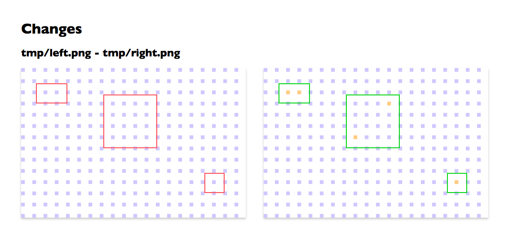

# image-diff-viewer

[](https://travis-ci.org/jinjor/image-diff-viewer)

Reports how images have been changed.



## Usage

### Install globally and run

```bash
$ npm install -g image-diff-viewer
```

```bash
$ image-diff-viewer left.png right.png -o index.html
```

```bash
$ image-diff-viewer -r dir1 dir2 -o index.html
```

### Install locally and use

```bash
$ npm install image-diff-viewer --save-dev
```

```javascript
const viewer = require("image-diff-viewer");
viewer.run("left.png", "right.png", {
    output: "index.html"
}).then(() => {
    ...
})
```

### Options

[Available Options](./src/cli.ts)

```bash
$ image-diff-viewer --help
```

## Status

Only PNG is supported.

## License

MIT